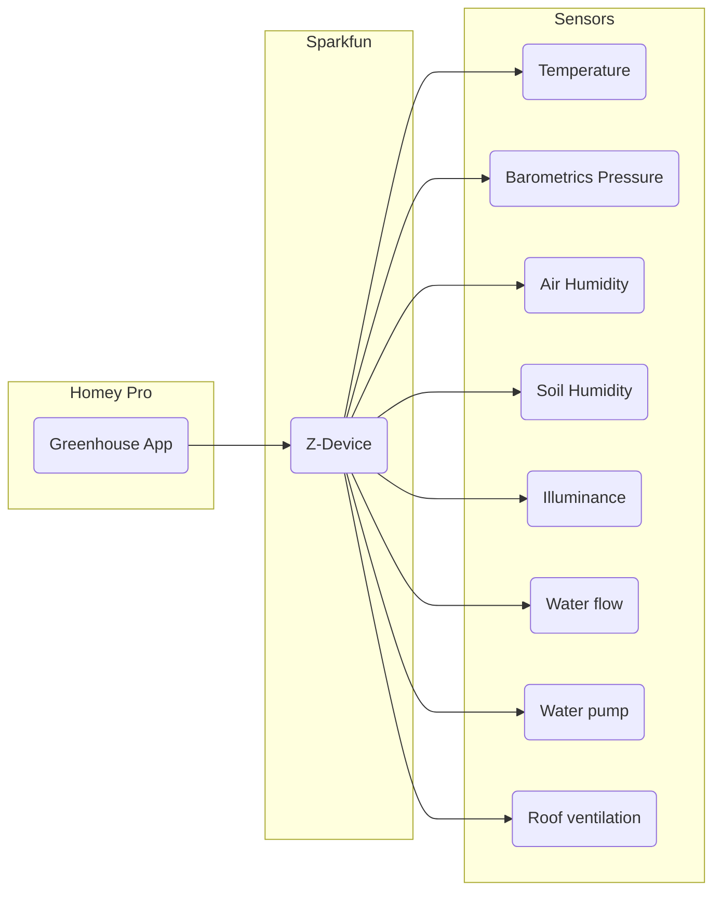

# System architecture description
## Overview
On a very high level view the solution consists of a homey application and a sparkfun board with sensors and actuators. The software on the sparkfun board implements a zigbee device with a set of endpoints for sensing and controlling. The software on the homey controller handles the zigbee device and endpoints. 

## Electronics
[Schematics](schematics.md)
[Sensor choices](sensor.md)
## Zigbee model
[The zigbee model](zigbee.md)
## Software
### Homey application
### ESP32-C6 application
