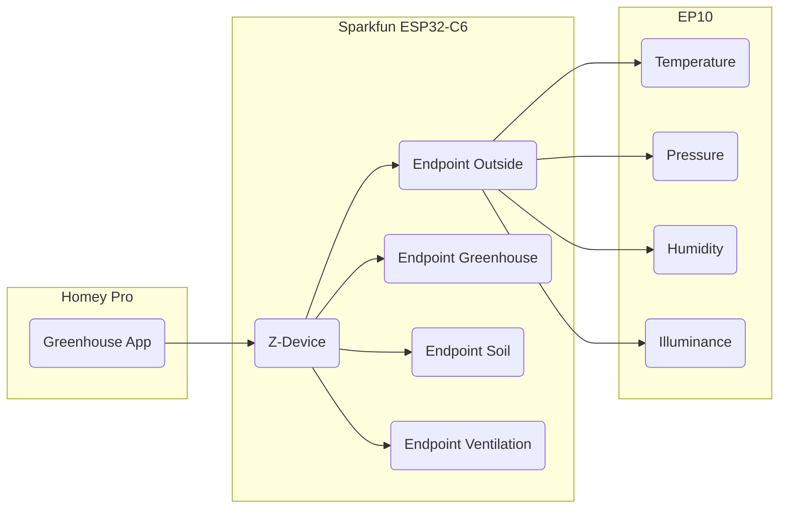

# System architecture description
## Overview
The system solution consists of software for the sparkfun device and the homey-controller. Electronics for the sparkfun device and the sensors and actuators.

## Electronics
## Zigbee model
[The zigbee model](zigbee.md)
## Software
### Homey application
### ESP32-C6 application
